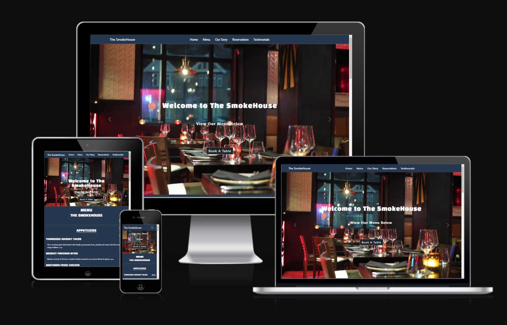
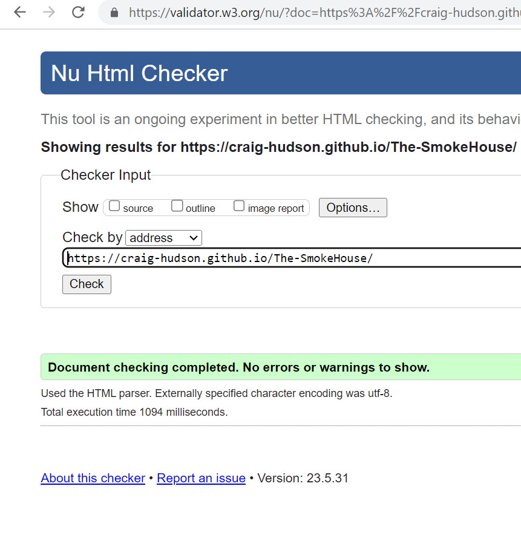
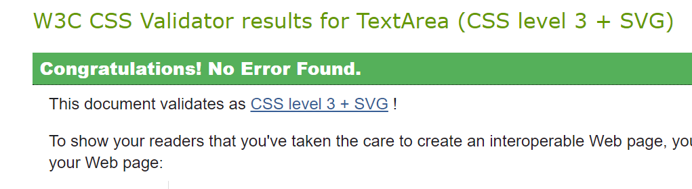
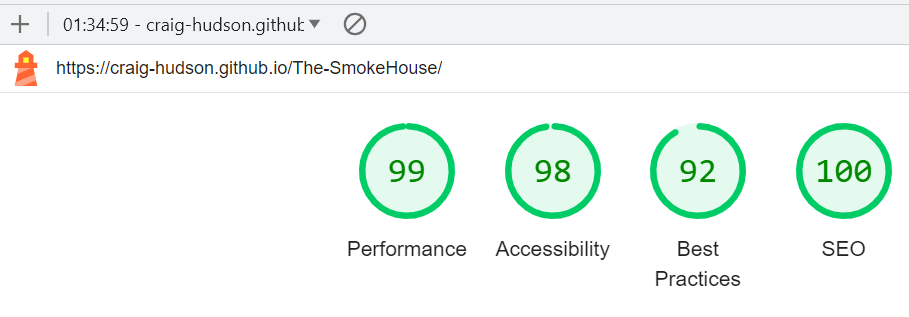
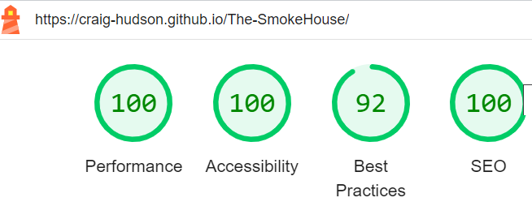
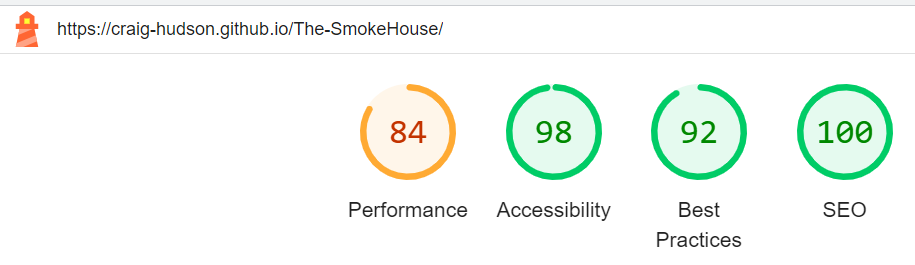
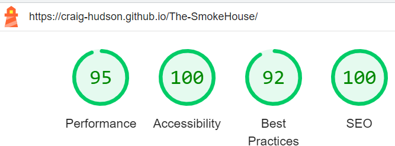
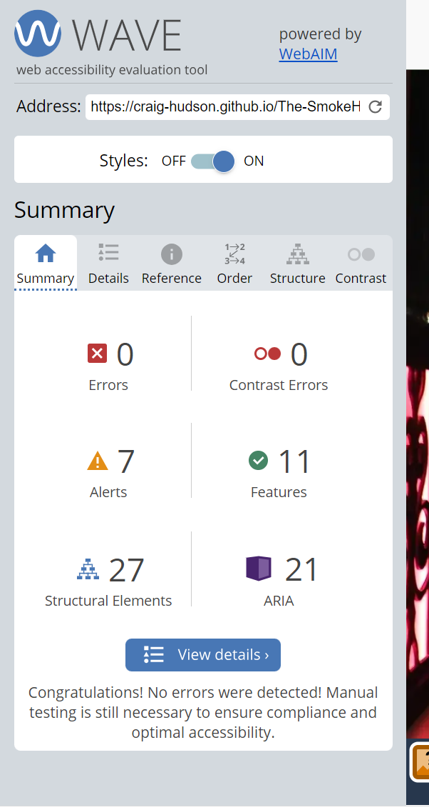

# The SmokeHouse

------------
[Link to live site here]( https://craig-hudson.github.io/The-SmokeHouse/ "Link to live site here")

## Table of Contents

- [The SmokeHouse](#the-smokehouse)
  - [Table of Contents](#table-of-contents)
  - [Introduction](#introduction)
  - [User Experience (UX)](#user-experience-ux)
    - [User Stories (US)](#user-stories-us)
    - [Design](#design)
    - [Accessability](#accessability)
  - [Features](#features)
    - [Favicon](#favicon)
    - [Image Carousel](#image-carousel)
    - [Pop up Modal](#pop-up-modal)
    - [Menu](#menu)
    - [Testimonials](#testimonials)
    - [Our Story](#our-story)
    - [Footer](#footer)
  - [Technologies Used](#technologies-used)
    - [Languages Used](#languages-used)
    - [Frameworks, Libraries \& Programs Used](#frameworks-libraries--programs-used)
  - [Deployment \& Local Development](#deployment--local-development)
    - [Deployment](#deployment)
    - [Local Development](#local-development)
      - [How to Fork](#how-to-fork)
      - [How to Clone](#how-to-clone)
  - [Testing](#testing)
    - [Automated Testing](#automated-testing)
      - [W3C Validator](#w3c-validator)
      - [Lighthouse](#lighthouse)
      - [Wave](#wave)
    - [manual Testing](#manual-testing)
      - [Testing User Stories](#testing-user-stories)
      - [Full Testing](#full-testing)
        - [Full Page Testing](#full-page-testing)
    - [Bugs](#bugs)
      - [Solved bugs](#solved-bugs)
      - [Known Bugs](#known-bugs)
  - [Credits](#credits)
    - [Code Used](#code-used)
    - [Content](#content)
    - [media](#media)
    - [Acknowledgments](#acknowledgments)

## Introduction

Here we have a fresh responsive website for a local independent restaurant.
The aims for this website are to make it easier for existing and new potential customers to be able to make online reservations and to be able to easily view what the restaurant offers and not only that we want all new potential customers to be able to view stunning images of our fresh modern restaurant, and we want them to be able to view testimonials from previous customers.

## User Experience (UX)

### User Stories (US)

- **First time visitor goals**
    1. As a first time visitor i want a nice clean site that is easy to navigate.
    2. As a first time visitor i want to be able to easily identify where to find the menu.
    3. As a first time visitor i want to be able to easily find the whereabouts of the restaurant.

  - **Returning Visitor goals**
    1. As a returning Visitor i want to be able to easily reserve a table.
    2. As a returning visitor i want to be able to easily find contact information for any queries.

### Design

- I will be using white smoke and #526D82 colour text against the background colours.
  - I will be using #27374D, #DDE6ED and white as background colors

  - **typography**
  - For headings I will be using Black Han Sans with a fallback of sans-serif.
    - For page text I will be using Quattrocento with a fall back of serif.

  - **Structure**
    - The structure will be a single scrolling page, with multiple pages with each section being clearly identifiable, and the use of a pop up modal for the reservation booking form which has a form dump which opens up in a new tab, to allow the user to be able to stay on the website itself to be able to continue browsing if they would like to. and the use of an image carousel to make the website more appealing and not overloading the website full of images that aren't contained.

  - **Imagery**
    - I will be using images of food and pictures of the restaurant to create more of a visual effect and to make the site more appealing to viewers, all of the images on the website were taken from [pexels](https://www.pexels.com/)

  - **Wireframes**

 [View wireframes here](/assets/wireframe-images/)

### Accessability

I have been attentive to make the website as accessible-friendly as possible through the following measures:

- Utilizing semantic HTML to provide meaningful structure and enhance accessibility.
- Incorporating descriptive alt attributes for images on the site to provide alternative text for screen readers.
- I also tested my website using wave which reports back to me any errors/contrast errors that may occur.
  
By implementing them few points above i have made my webpage as accessible and user friendly as possible taking into account those who may be visually impaired and require screen readers for assistance.

## Features

- The Smokehouse webpage is a single page website which contains a navbar, which comprises of a hamburger menu for smaller devices, a pop up modal for reservation booking, an image carousel with a welcome message,a menu section, our story section, testimonial section and a footer.

### Favicon

- A favicon in the browser tab
  

### Image Carousel

- A carousel of images at the top of the page, with a welcome message on the first image

### Pop up Modal

- I went with a pop up modal booking form rather than having a booking form on a separate page, this was to keep the structure of the website all contained onto 1 page that is scrollable rather than just having 1 page that splits off from the rest of the website.

### Menu

- I created a basic menu with starters and mains

### Testimonials

- I created a testimonial section to show new customers what they can expect from the company

### Our Story

- I created a heading with an image to open up the our story section

- Then i have created a section that gives a brief overview of the history and gives contact, location, and opening times below.

### Footer

- A footer at the bottom of the page with the copyright and navigation links for social networks

## Technologies Used

### Languages Used

HTML, CSS and Bootstrap have been used for this project

### Frameworks, Libraries & Programs Used

Git - For version control.
​

[Github](https://github.com/Craig-Hudson) - To save and store the files for the website.

​
[Google Fonts](https://fonts.google.com/) - To import the fonts used on the website.

​
[Font Awesome](https://fontawesome.com/) - For the iconography on the website.

​
Chrome Dev Tools - To troubleshoot and test features, solve issues with responsiveness and styling.

[Bootstrap v5.0](https://getbootstrap.com/docs/5.0/getting-started/download/) - To help create a responsive website with the use of bootstrap grid, and bootstrap classes

[tiny.png](https://tinypng.com/) - To reduce the file size of my images for better website performance

[Image resizer](https://imageresizer.com/) - To reduce any unnecessary height and width on photos, also minimizing file size

[visily](https://app.visily.ai/) To create my wireframes.

[W3School](https://www.w3schools.com/) To refer to anything CSS related that i may have been unsure of

[Pexels](https://www.pexels.com/) I used pexels for all my images for this project

VsCode - I have used vscode as my ide

[Covertio.co](https://convertio.co/jpg-webp/) I have used Convertio to convert image formats to webp

## Deployment & Local Development

### Deployment

Github Pages was used to deploy the live website. The instructions to achieve this are below:
​

1. Log in (or sign up) to Github.
2. Find the repository for this project here > [The Smokehouse](<https://github.com/Craig-Hudson/The-SmokeHouse>)
3. Click on the Settings link.
4. Click on the Pages link in the left hand side navigation bar.
5. In the Source section, choose main from the drop down select branch menu. Select Root from the drop down select folder menu.
6. Click Save. Your live Github Pages site is now deployed at the URL shown.
​

### Local Development

#### How to Fork

​
To fork The SmokeHouse repository:
​

1. Log in (or sign up) to Github.
2. Go to the repository for this project, The SmokeHouse !(<https://github.com/Craig-Hudson/The-SmokeHouse>)
3. Click the Fork button in the top right corner.
​

#### How to Clone

​
To clone The SmokeHouse repository:
​

1. Log in (or sign up) to GitHub.
2. Go to the repository for this project, Birmingham-egg-milestone-project.
3. Click on the code button, select whether you would like to clone with HTTPS !(<https://github.com/Craig-Hudson/The-SmokeHouse>) and copy the link shown.
4. Open the terminal in your code editor and change the current working directory to the location you want to use for the cloned directory.
5. Type 'git clone' into the terminal and then paste the link you copied in step 3. Press enter.
​

## Testing

### Automated Testing

#### W3C Validator

- index.html file no errors or infos reported
  

- CSS file contains one warning with regards too google imports, no errors
- Custom CSS

- CSS Coming from bootstrap contains 215 warnings. [Link to CSS Jigsaw validator here](https://jigsaw.w3.org/css-validator/validator?uri=https%3A%2F%2Fcraig-hudson.github.io%2FThe-SmokeHouse%2F&profile=css3svg&usermedium=all&warning=1&vextwarning=&lang=en)

#### Lighthouse

- **Desktop Report**
- First desktop report

- Final desktop report

- **Mobile Report**
- First Mobile report

- Final mobile report

#### Wave

- I have conducted a wave report of my website there are no errors, no contrast errors,
  but there are 7 alerts, 6 for Suspicious alternative text and one for a possible heading on my image carousel text.

### manual Testing

#### Testing User Stories

|  First Time Visitors |   |
| ------------ | ------------ |
|  Goals | How They are achieved  |
| As a first time visitor i want a nice clean site that is easy to navigate.  |  This was achieved with a clear navigation bar at the top of the page, and the use of a hamburger menu for navigation on devices with a less than 768px
| As a first time visitor i want to be able to easily identify where to find the menu  | This was achieved by having a link in the navigation bar at the top of the page which would take a user directly to the menu section, also there is a link for the menu on the first carousel image which would take a user to the menu  |
|  As a first time visitor i want to be able to easily find the whereabouts of the restaurant | This was achieved by having the location of the restaurant in the our story section of the page.  
| Returning Visitor goals  |   |
| As a returning Visitor i want to be able to easily reserve a table.  | This was achieved by keeping to the single page theme and adding a pop up modal when the user clicks on the reservation navigation link, and also in the book now link that is in the carousel.  
|  As a returning visitor i want to be able to easily find contact information for any queries.  |  This was achieved by adding a contacts section under the our story section that contains the contact information of the restaurant|

#### Full Testing

Full testing was done on the following devices:

- laptop
  - HP Pavilion plus laptop (14inch)

- Mobile
  - Oppo find x5 lite (6.42inch)

Full testing was done on the following browsers:

- Google Chrome
- Firefox

##### Full Page Testing

|  Feature | Expected Outcome  | Testing Performed  | Result  | Pass/Fail  |
| ------------ | ------------ | ------------ | ------------ | ------------ |
| Home nav link  | Page to reload  | Click home link  | Page Reloaded  | Pass  |
| Menu nav link  | To take me to the menu  | click menu link  | Took me to menu section  | Pass  |
| Our story nav link | To take me to our story section  | click out story link  | Took me to our story section  | Pass   |
| Reservation nav link | For modal to pop up  | Click reservation link  |  Modal popped up | Pass  |
| Testimonials nav link  | To take me to testimonials section  | Click testimonial link  | Took me to testimonial section  | Pass  |
| Modal close button  | For modal to close  | Click close button  | Modal was closed |  Pass  |
| carousel menu link  | To take me to menu   | Click menu link   | Took me to Menu section   | Pass   |
| Carousel Book a table link   | To take me to reservation booking form   | Click Link   | Took me to booking form   | Pass  |
| hover effect navbar links  | To change color when cursor is over each link   | Hover cursor over links  | links changed colour   |Pass  |
|  Carousel automatic start  |  for carousel to automatically start without clicking next or prev buttons  | Reload page to see if automatic carousel started   |  Carousel automatically started  |  Pass   |
|  Carousel Manual scroll  |  when next and previous buttons are clicked it will go through the images  | Click next and previous buttons   | both next and previous buttons work and go through the images  | Pass   |
| font awesome icon links   | for each link to take me to its intended destination   | Click link   |  All links took me intended destination  | Pass |
| 404 page | if a link is broken or incorrect i be directed to the 404 page and be able to return back to the main website   |  enter incorrect link and see if there is a easy way to get back to the website| Entered broken link which took me to the 404page, and there is a clear button to click which took me back to my website |Pass |

### Bugs

#### Solved bugs

|  no   | Bug  | How i Solved the bug|
| ------------ | ----------- | -------------- |
| 1 | On wider screen widths the menu alignment got far to stretched and looked off  | I noticed i had the bootstrap class container-fluid set as the container which gives the container the full width of the screen, so i changed the bootstrap class to container, which will only allow the width on the container to be as wide as the content inside of it  |
| 2 |  On Different screen widths the testimonial sections alignment of the images and the star ratings would not align horizontally  | I had a play around with different flexbox properties and i ended up aligning the container of the testimonial section to align-items: flex-start as they aligned the images and the star ratings  |
|3 |In the menu section when i hit the 992px breakpoint the menu would shrink to 50% width but all still be in one column,it would only turn into 50% width when it hits 993px and turns into two columns side by side| I used chrome developer tools and played around with my code on their until i found the culprit was in the wrong media query so i just swapped the code over into the correct media query, and all seems to be working well since the fix.  |
|4 | In the Our story section where there is contact information, the email address ending up spanning onto two lines when it should only be on one line between screen width of 992px and 1200px| I played around with margins for the row that contained the email address until the email was completely on one line and then entered a min-width / max width media query to solve this issue  |

#### Known Bugs

|  known bugs | Bug issue  | Plan to resolve  |
| ------------ | ------------ | ------------ |
| 1  | On wider screen widths the menu alignment got far to stretched and looked off  | I plan to ensure that the container is only as wide as it needs to be  |
| 2 | On Different screen widths the testimonial sections alignment of the images and the star ratings would not align horizontally  | I plan to use flexbox to resolve this issue.  |

## Credits

### Code Used

[Bootstrap carousel](http://https://getbootstrap.com/docs/5.3/components/carousel/#how-it-works "Bootstrap carousel") - I used the code from bootstrap to create the structure of the carousel and have added additional bootstrap classes and my own classes where necessary.

[Bootstrap hamburger menu](http:/https://getbootstrap.com/docs/5.3/components/navbar/#how-it-works/ "Bootstrap hamburger menu") - I used the code from bootstrap v 5.3 to create the hamburger menu

[Bootstrap modal](https://getbootstrap.com/docs/5.3/components/modal/#how-it-works "Bootstrap Modal") - I have used the code from bootstrap to create the pop up modal, and then have targeted the classes for my own styles

NOTE: All id selectors and !important were used in my css to override the css coming from bootstrap

### Content

The use of the bootstrap library was used to create the carousel,hamburger menu and the modal thats used reservation booking form.

The other content for this project was written by Craig Hudson

### media

- All Images for the site were all taken from [pexels](https://www.pexels.com/)

### Acknowledgments

I would like to acknowledge the following people who helped me along the way in completing this project:

- My code institute mentor Narender Singh for all his help and patience with me !
- My partner for having the patience with me and allowing me more time to work on projects.
- My fellow classmates for any hints and tips that they have given me over the last two months.
